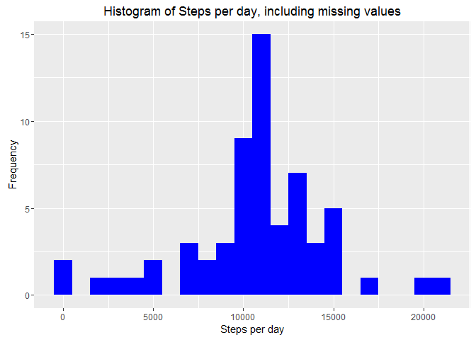
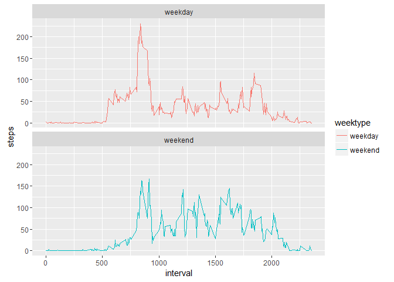

```{r setup, include=FALSE}
knitr::opts_chunk$set(echo = TRUE)
```
## Loading Libraries
```{r}
library(lubridate)
library(dplyr)
library(ggplot2)
```

## Loading and preprocessing the data
### 1. Load the raw data
```{r}
rw <- read.csv("activity.csv", header = TRUE, 
               colClasses = c("numeric", "character","integer"))
```
### 2. Process the data
```{r}
rw$date <- ymd(rw$date)
```

## What is mean total number of steps taken per day?
### 1. Filter out null steps
```{r}
rw_ft = filter(rw, !is.na(steps))
```
### 2. Aggregate sum of steps per day
```{r}
rw_ag_steps = aggregate(steps ~ date, data = rw_ft, sum)
```
### 3. Histogram of the total number of steps taken each day
```{r}
ggplot(rw_ag_steps, aes(x = steps)) +
    geom_histogram(fill = "blue", binwidth = 1000) +
    labs(title = "Histogram of Steps per day", 
         x = "Steps per day", 
         y = "Frequency")
```
 

### 4. Mean and median number of steps taken each day
```{r, results='asis'}
mean_steps = mean(rw_ag_steps$steps, na.rm = TRUE)
median_steps = median(rw_ag_steps$steps, na.rm = TRUE)

print(mean_steps)
print(median_steps)
```

## What is the average daily activity pattern?
### 1. Aggregate mean of steps per interval
```{r}
rw_ag_act = aggregate(steps ~ interval, data = rw_ft, mean)
```

### 2. Time series plot of the average number of steps taken
```{r}
ggplot(rw_ag_act, aes(x=interval, y=steps)) +
    geom_line(color = "blue")
```
     

### 3. The 5-minute interval that, on average, contains the maximum number of steps
```{r, results='asis'}
rw_ag_act[which.max(rw_ag_act$steps),]
```

## Imputing missing values
### 1. Calculate and report the total number of missing values in the dataset 
```{r, results='asis'}
total_na = sum(is.na(rw$steps))

print(total_na)
```

### 2. Create a new dataset that is equal to the original dataset but with the missing data filled in
#### The idea is to 
1. Extract an array of boolean index: <span style="color:red">na_index</span>
2. Calculate average steps per 5 min interval using <span style="color:red">tapply</span>
3. Fill in each NA values by using the average steps per interval
```{r}
rw_full <- rw
na_index <- is.na(rw_full$steps)
avg_interval <- tapply(rw_full$steps, rw_full$interval, mean, na.rm=TRUE, simplify=TRUE)
rw_full$steps[na_index] <- avg_interval[as.character(rw_full$interval[na_index])]

total_full = sum(is.na(rw_full$steps))
print(total_full)
```

### 3. Aggregate sum of steps per date
```{r}
steps_full = filter(rw_full, !is.na(steps))
steps_ag_full = aggregate(steps ~ date, data=steps_full, sum)
```

### 4. Make a histogram of the total number of steps taken each day
```{r}
ggplot(steps_ag_full, aes(x = steps)) +
    geom_histogram(fill = "blue", binwidth = 1000) +
    labs(title = "Histogram of Steps per day, including missing values", 
         x = "Steps per day", y = "Frequency")
```


### 5.Calculate and report the mean and median total number of steps taken per day
```{r, results='asis'}
mean_full = mean(steps_ag_full$steps, na.rm = TRUE)
median_full = median(steps_ag_full$steps, na.rm = TRUE)

print(mean_full)
print(median_full)
```

#### Note: The impact of the imputting turns out eqaulizing mean steps to median.

## Are there differences in activity patterns between weekdays and weekends?
### 1. Create a new factor variable in the dataset with two levels - "weekday" and "weekend" 
```{r}
rw_full <- mutate(rw_full, weektype = ifelse(weekdays(rw_full$date) == "Saturday" 
                                             | weekdays(rw_full$date) == "Sunday", 
                                             "weekend", "weekday"))
rw_full$weektype <- as.factor(rw_full$weektype)
```

### 2. Aggregate mean of steps per interval and weektype 
```{r}
interval_full = aggregate(steps ~ interval + weektype, data=rw_full, mean)
```

### 3. Make a panel plot containing a time series plot (i.e. type = "l") of the 5-minute interval (x-axis) and the average number of steps taken, averaged across all weekday days or weekend days (y-axis). 
```{r}
ggplot(interval_full, aes(x=interval, y=steps, color = weektype)) +
    geom_line() + facet_wrap(~weektype, ncol = 1, nrow=2)
```
